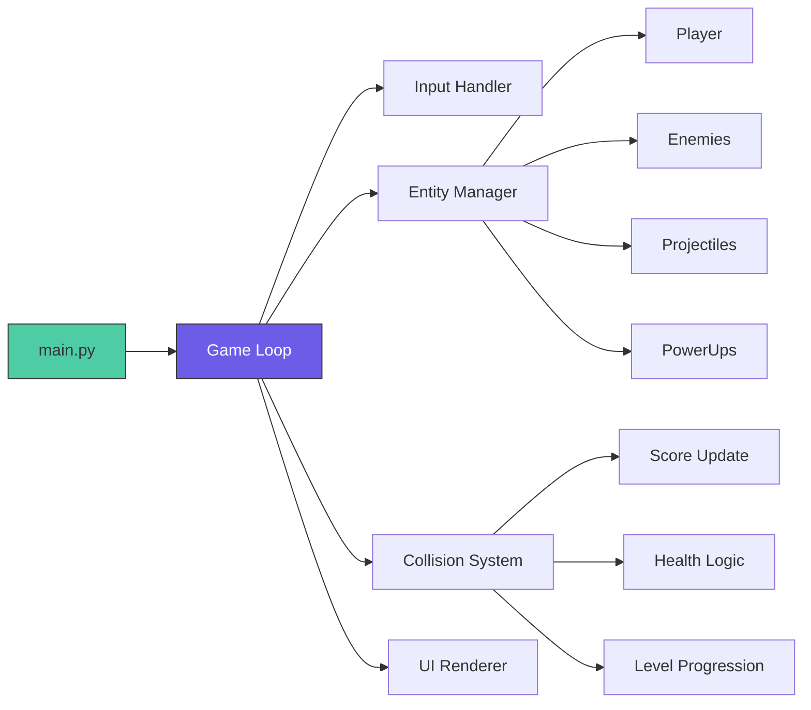

# 🚀 Space Shooter
> *Retro Arcade Action • Built with Python & Pygame*

[](https://python.org)
[](https://www.pygame.org)
[](LICENSE)
[](#)

A fast-paced, retro-style scroll shooter built with Python & Pygame. Designed for instant fun, polished visuals, and clean, extensible code. Perfect for portfolio demos, game jams, or just blowing off steam. 🎮✨

---

## 🎯 Project Overview
**Problem**: Classic arcade games are fun to play but rare to find with clean, educational codebases.  
**Goal**: Build a polished, playable space shooter that demonstrates:
- Real-time game loop architecture & frame-rate independence
- Object-oriented entity management (player, enemies, projectiles, power-ups)
- Collision detection, scoring, and progression systems
- Visual polish: sprites, VFX, audio, UI feedback

**Domain**: Game Development / Interactive Software  
**Project Type**: Academic Group Project (Final Semester)

---

## 🎮 Quick Start
```bash
git clone https://github.com/SY33DHAWK/Space-Shooter.git
cd Space-Shooter
pip install -r requirements.txt
python main.py
```
> 🎯 *Controls: <kbd>←</kbd><kbd>→</kbd> Move • <kbd>SPACE</kbd> Shoot • <kbd>P</kbd> Pause • <kbd>ALT+ENTER</kbd> Fullscreen*

---

## ✨ Features at a Glance
| 🎯 Player Controls | 👾 Enemy AI | 💥 Combat System | 🏆 Progression |
|-------------------|-------------|----------------|----------------|
| <kbd>←</kbd><kbd>→</kbd> Smooth movement | Wave-based spawning | Laser projectiles + VFX | Score tracking |
| <kbd>SPACE</kbd> Rapid fire | Difficulty scaling | Power-up drops | High-score save |
| <kbd>P</kbd> Pause menu | Basic pathfinding | Collision detection | Level unlocks |

---

## 🎨 Asset Showcase
<div align="center">

| Player Ship | Enemy Types | Power-Ups | Boss Fight |
|-------------|-------------|-----------|------------|
|  |  |  |  |

| Background | Explosions | UI Elements | Menu Screen |
|------------|------------|-------------|-------------|
|  |  |  |  |

</div>

---

## 🔬 Core Mechanics
1. **Game Loop**: Fixed timestep + delta-time movement for FPS-independent physics
2. **Entity Management**: OOP pattern with base `Entity` class + specialized subclasses
3. **Collision System**: AABB detection + event-driven feedback (score, damage, VFX)
4. **Progression Logic**: Wave-based difficulty scaling + persistent high-score storage
5. **Visual Polish**: Particle effects, screen shake, animated sprites, parallax background

### 📈 Key Visual Feedback
| Effect | Purpose | Implementation |
|--------|---------|---------------|
|  | Hit confirmation | Animated sprite sequence + sound cue |
| Screen shake | Impact weight | Temporary camera offset + lerp recovery |
| Particle trail | Motion clarity | Simple alpha-fading sprite pool |
| Health bar UI | Player status | Dynamic render + color-coded thresholds |

---

## 🧠 Architecture Overview

---

## 🛠 Tech Stack
Core:
  - Python 3.10+
  - Pygame 2.5+ (graphics, audio, input)

Assets:
  - Pixel-art sprites (player, enemies, VFX)
  - 8-bit sound effects & background music
  - Parallax starfield background

Engineering:
  - Object-oriented Entity/Component pattern
  - Delta-time movement (frame-rate independent)
  - JSON-based high-score persistence
  - Modular design for easy feature extension

Reproducibility:
  - requirements.txt
  - Clear file structure + inline comments

Engineering:
  - Object-oriented Entity/Component pattern
  - Delta-time movement (frame-rate independent)
  - JSON-based high-score persistence
  - Modular design for easy feature extension

Reproducibility:
  - requirements.txt
  - Clear file structure + inline comments

## 🎯 Design Philosophy
> *"Fun first, theory second"*

| Principle | How We Implemented It |
|-----------|----------------------|
| ⚡ Instant Feedback | Screen shake on hit • Particle explosions • Audio cues |
| 🎮 Accessible Difficulty | Gradual wave scaling • Optional power-ups • Checkpoint system |
| ✨ Polish Over Complexity | Smooth animations • Responsive controls • Clean UI |
| 🔧 Extensible Code | New enemies/weapons added in <10 lines |

---

## 👥 Team Contributions
| Member | Role | Key Contributions |
|--------|------|------------------|
| **Sheikh Syeed Ul Haque** ([@SY33DHAWK](https://github.com/SY33DHAWK)) | Core Engineer | Game loop, collision system, entity architecture, scoring logic |
| **Shadman Abrar** ([@Shadman-Abrar](https://github.com/Shadman-Abrar)) | Visual Designer | Sprite art, VFX, UI polish, audio integration, menu flow |

*Collaborative workflow: GitHub + Pygame + regular playtesting syncs*

---

## ⚠️ Known Quirks (v1.0)
- ⚡ Very high FPS may cause faster gameplay (fixed in v1.1 with delta time)
- 🔊 Audio may lag on first launch (Pygame mixer initialization)
- 🪟 Toggle fullscreen: <kbd>ALT</kbd>+<kbd>ENTER</kbd>
- 🎨 Asset paths assume `assets/` folder structure

---

## 🚀 Future Upgrades (Backlog)
- [ ] 🎮 Local co-op multiplayer (split-screen)
- [ ] 🧩 JSON-moddable enemy waves & weapons
- [ ] 📱 Mobile port with touch controls (Pygame subset)
- [ ] 🌐 Online leaderboard (Flask backend + SQLite)
- [ ] ♾️ Procedural infinite mode with seed-based generation

---

## 📄 License
MIT License — Play, modify, share freely. See [LICENSE](LICENSE).

---

<div align="center">

### 🌟 Loved the game?
[⭐ Star this repo](https://github.com/SY33DHAWK/Space-Shooter/stargazers) • [🐞 Report a bug](https://github.com/SY33DHAWK/Space-Shooter/issues) • [💡 Suggest a feature](https://github.com/SY33DHAWK/Space-Shooter/discussions)

> *"Easy to learn. Hard to master. Impossible to put down."* 🕹️✨

</div>
```

