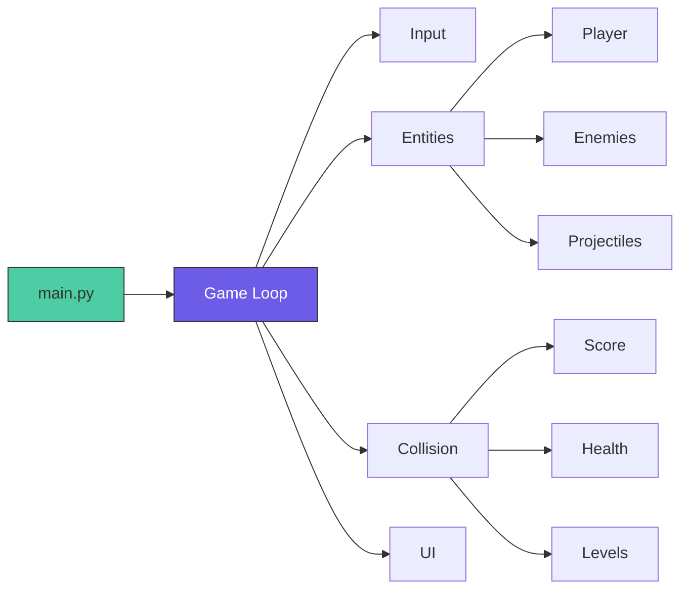

```markdown
# 🚀 Space Shooter
> *Retro Arcade Action • Built with Python & Pygame*

[](https://python.org)
[](https://www.pygame.org)
[](LICENSE)
[](#)

<div align="center">
  
  <br><br>
  
  <br>
  <sub>🔊 Sound On • <kbd>←</kbd><kbd>→</kbd> Move • <kbd>SPACE</kbd> Shoot • <kbd>P</kbd> Pause</sub>
</div>

---

## 🎮 Quick Play
```bash
git clone https://github.com/SY33DHAWK/Space-Shooter.git
cd Space-Shooter
pip install -r requirements.txt
python main.py
```

---

## ✨ Features
<div align="center">

| 🎯 Controls | 👾 Enemies | 💥 Combat | 🏆 Progression |
|------------|-----------|-----------|---------------|
| <kbd>←</kbd><kbd>→</kbd> Move | Wave-based spawns | Laser projectiles | Score tracking |
| <kbd>SPACE</kbd> Shoot | Difficulty scaling | Power-up drops | High-score save |
| <kbd>P</kbd> Pause | Pathfinding AI | Collision VFX | Level unlocks |

</div>

---

## 🎨 Visual Showcase
<div align="center">

| Player | Enemies | Power-Ups | Boss |
|--------|---------|-----------|------|
|  |  |  |  |

</div>

---

## 🧠 Architecture


---

## 🛠 Tech Stack
```yaml
Core: Python 3.10+ • Pygame 2.5+
Assets: Pixel sprites • 8-bit SFX • Parallax background
Engineering: OOP design • Delta-time movement • JSON persistence • Modular architecture
```

---

## 🎯 Design Philosophy
> *Fun first, theory second*

- ⚡ **Instant Feedback**: Screen shake, particles, audio cues
- 🎮 **Accessible Difficulty**: Gradual scaling, optional power-ups
- ✨ **Polish Over Complexity**: Smooth animations, responsive controls
- 🔧 **Extensible Code**: New features in <10 lines

---

## 🚀 Roadmap
- [ ] Local co-op multiplayer
- [ ] JSON-moddable enemy waves
- [ ] Mobile touch controls
- [ ] Online leaderboard (Flask)
- [ ] Procedural infinite mode

---

## 👥 Team
<div align="center">

|  |  |
|--------------------------------------------------------------------------------|------------------------------------------------------------------------------------|
| **Sheikh Syeed Ul Haque**<br>[@SY33DHAWK](https://github.com/SY33DHAWK)<br>🎮 Core Mechanics | **Shadman Abrar**<br>[@Shadman-Abrar](https://github.com/Shadman-Abrar)<br>🎨 Assets & Polish |

</div>

---

## ⚠️ Known Quirks (v1.0)
- ⚡ High FPS may affect speed (fixed in v1.1 with delta time)
- 🔊 Audio may lag on first launch (Pygame mixer init)
- 🪟 Toggle fullscreen: <kbd>ALT</kbd>+<kbd>ENTER</kbd>

---

## 📄 License
MIT License — Play, modify, share freely. See [LICENSE](LICENSE).

---

<div align="center">

### 🌟 Enjoyed the game?
[⭐ Star](https://github.com/SY33DHAWK/Space-Shooter/stargazers) • [🐞 Report Bug](https://github.com/SY33DHAWK/Space-Shooter/issues) • [💡 Suggest Feature](https://github.com/SY33DHAWK/Space-Shooter/discussions)

> *"Easy to learn. Hard to master. Impossible to put down."* 🕹️

</div>
```
